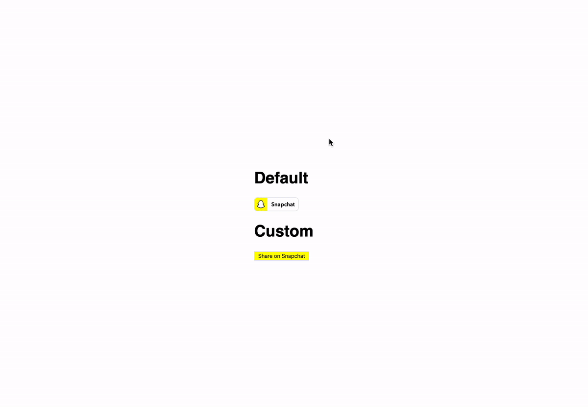

# React Snapshare


> Snapchat share button

[](https://www.npmjs.com/package/react-snapshare) [](https://standardjs.com)



## Requirements

- An app created on the [Snap Kit developer portal](https://kit.snapchat.com/portal)
- A website to add the share button
- Users on Snapchat 10.67+

## Getting started

To start using Creative Kit Web you will need to complete the following steps on the [Snap Kit developer portal](https://kit.snapchat.com/portal) under your app's settings:

1. Turn the toggle for 'Creative Kit' to ON under the 'Kits' section.
2. Once turned on, a new section will appear titled 'Whitelisted Attachment URL Domains'
3. Add the base url of your website to the 'Whitelisted Attachment URL Domains' list. For example, if your article is hosted at https://www.snapchat.com/article/helloWorld you need only enter https://www.snapchat.com. Be sure to include the https:// so as to pass URL validation.
4. If you are using multiple testing environments, you will need to add all the base urls to this list like https://dev.snapchat.com , https://staging.snapchat.com

## Install

```bash
npm install --save react-snapshare
```

or

```bash
yarn add react-snapshare
```

## Usage

### Default Snapshare Button

```jsx
import React, { Component } from "react";
import { Snapshare } from "react-snapshare";

class Example extends Component {
  render() {
    return (
      <Snapshare
        dataShareUrl="https://twang.dev/react-snapshare/"
        stickerAssetURL="https://kit.snapchat.com/ckweb/test/image.png"
      />
    );
  }
}
```

or

### Custom Snapshare Button

Use your own styles

```jsx
import React, { Component } from "react";
import { SnapshareCustom } from "react-snapshare";

class Example extends Component {
  render() {
    return (
      <SnapshareCustom
        customButtonStyles={{ background: "yellow" }}
        customButtonClass="snapchat-button"
        dataShareUrl="https://twang.dev/react-snapshare/"
      />
    );
  }
}
```

## Props

### Common Props

#### dataShareUrl (string)

The URL of the attachment to be shared. If not provided, this will default to the address of the page hosting the button (i.e. window.location.href)

#### stickerAssetURL (string)

1000 x 1000px
Transparent background
Less than 1MB
PNG format
Animated stickers in GIF format are supported only on iOS. On Android please use WebP.

#### publisherID (string)

In order to link the Creative Kit Share back to yourself as a Discover Publisher, you can add an additional meta tag to the html. First, obtain your publisher ID from [Story Studio](https://publish.snapchat.com/).

### Default Snapshare Button

#### dataTheme (string)

light/dark. The share button supports two themes - light and dark. By default, the button uses the light theme. In order to use the dark theme, simply set data-theme=”dark” on the div.

#### dataSize (string)

small/large. The share button supports two sizes - a 'small' size (66x20), and a 'large' size (90x28). By default, the button uses the large size. In order to use the small size, simply set data-size=”small” on the div.

#### dataText (string)

The share button includes our Ghost logo, and a 'Snapchat' label by default. If you would like to hide the text and only show the logo, you can set data-text="false" on the div. This will change the size of the button to 28x28 and 20x20 for the large and small sizes respectively.

### Custom Snapshare Button

#### customButtonStyles (object)

Inline styles for your custom button. Format as [React inline styles](https://reactjs.org/docs/dom-elements.html#style).

#### customButtonClass (string)

CSS class you can apply to your button.

## Behavior of the Share Button

- On Desktop - If a user on desktop clicks the Snapchat share button, a new window will open with a Snapcode and information about the page. This information is pulled from OG tags - og:title, and og:site_name. The user can scan the Snapcode with the Snapchat camera, and the link will attach the URL to Snapchat.

- On Mobile Web - If a user on a mobile device taps on the Snapchat share button, one of two things will happen:
  1. Snapchat app installed - the user will be deep linked into the Snapchat app, and be presented with a modal containing information about the page. This information is pulled from OG tags - og:title, and og:site_name. The modal will also contain prompts to attach the URL to a Snap, or send the URL via chat.
  2. Snapchat app not installed - the user will be prompted to open the App/Play Store to get the Snapchat app.

## License

MIT © [thomaswangio](https://github.com/thomaswangio)
